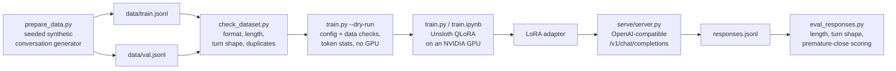

# llm-finetuning-recipes

[](https://github.com/25andresbernal/llm-finetuning-recipes/actions/workflows/ci.yml)

A QLoRA fine-tuning recipe for a short-turn conversational phone agent,
built on `unsloth/llama-3-8b-bnb-4bit`, with a synthetic dataset generator,
a dataset validator, an offline response scorer, an OpenAI-compatible
serving stub, and the config that came out of five training iterations.

## Why this exists

Fine-tuning a small model for a narrow, latency-bound job (one turn of a
phone call) is a different problem than fine-tuning a model to be broadly
good at a task. The failure modes are specific: overfitting on a small
dataset, a model that monologues instead of taking turns, a model that
passes isolated tests and then does the wrong thing on a real
back-and-forth conversation. I hit all three building an earlier version of
this recipe. `docs/lessons-from-five-iterations.md` is the honest account
of that; this repository is the recipe, the dataset checker, and the eval
that came out of it, rebuilt from scratch against a synthetic,
industry-neutral dataset so it is safe to publish and safe to run.

Nothing here trains on or contains real call data, real customer
information, or any client's product. The dataset is generated by a seeded
script for a fictional home-repair scheduling business.

## Demo

Real output, not illustrative. Generating the dataset:

```
$ uv run python scripts/prepare_data.py --num-examples 300 --seed 13 --out-dir data/sample
wrote 254 train examples to data/sample/train.jsonl
wrote 46 val examples to data/sample/val.jsonl
total 300 examples, seed 13
```

Validating it:

```
$ uv run python scripts/check_dataset.py data/sample/train.jsonl data/sample/val.jsonl
Dataset: data/sample/train.jsonl
Total examples: 254

Target length (words): min=6 max=18 mean=9.8 median=9.0
  distribution: <5=0, 5-15=248, 16-25=6, >25=0
Turn shape: 108 questions, 146 statements

Format: 0 issue(s)
Speaker labels: 0 issue(s)
Target length: 0 issue(s)
One question or one statement: 0 issue(s)
Duplicate prompts: 0 issue(s)

PASS

Dataset: data/sample/val.jsonl
Total examples: 46
...
PASS
```

Checking the config and the formatted data without a GPU:

```
$ uv run python recipes/conversational-agent-qlora/train.py --dry-run
config.yaml is valid.
base_model: unsloth/llama-3-8b-bnb-4bit
lora: r=16 alpha=16 dropout=0.1 target_modules=['q_proj', 'k_proj', 'v_proj', 'o_proj', 'gate_proj', 'up_proj', 'down_proj']
training: lr=0.0002 epochs=5 per_device_train_batch_size=2 gradient_accumulation_steps=4 (effective batch 8)

Dataset: .../data/sample/train.jsonl
Total examples: 254
...
PASS

train token stats (estimated, ~4 chars/token, not the real tokenizer):
  n=254 min=136 max=355 mean=253.0 median=244.0 over_max_seq_length=0
val token stats (estimated, ~4 chars/token, not the real tokenizer):
  n=46 min=182 max=354 mean=252.7 median=244.0 over_max_seq_length=0

Example formatted prompt (first train example):
<|begin_of_text|><|start_header_id|>system<|end_header_id|>

You are the phone scheduling assistant for Cedar Creek Home Services, a home repair and maintenance company. Handle one thing at a time...<|eot_id|><|start_header_id|>assistant<|end_header_id|>

Thanks for calling Cedar Creek Home Services, how can I help you today?<|eot_id|><|start_header_id|>user<|end_header_id|>

Hi, this is Hayden. I need someone to look at an outlet that stopped working.<|eot_id|><|start_header_id|>assistant<|end_header_id|>

What day this week works best for you?<|eot_id|>...

Dry run complete. No model was loaded, no GPU was used.
```

Scoring a batch of model responses offline:

```
$ uv run python scripts/eval_responses.py data/sample/responses_sample.jsonl
id            words  len_ok  1clause  question  prem_close
----------------------------------------------------------
resp-001          8    True     True      True       False
resp-002         14    True     True     False       False
resp-003         12    True    False      True       False
resp-004         17    True     True     False        True
resp-005         10    True     True      True       False
resp-006          1   False     True     False       False
resp-007         32   False     True     False       False
resp-008          8    True     True     False       False
resp-009          4   False     True     False        True
resp-010          6    True     True      True       False
----------------------------------------------------------
10 responses | 7/10 in length band | 9/10 single-clause | 2/10 flagged premature-close | mean words 11.2
```

## Architecture



## Quick start

Everything below runs offline, on any machine, in under five minutes. No
GPU, no API key, no network access beyond installing packages.

```bash
git clone https://github.com/25andresbernal/llm-finetuning-recipes.git
cd llm-finetuning-recipes

export PATH="$HOME/.local/bin:$PATH"   # if uv is not already on PATH
uv venv --python 3.12
uv pip install -e ".[dev]"

# Regenerate the committed sample dataset (deterministic, same seed => same file)
uv run python scripts/prepare_data.py --num-examples 300 --seed 13 --out-dir data/sample

# Validate it
uv run python scripts/check_dataset.py data/sample/train.jsonl data/sample/val.jsonl

# Check the training config and data shape without a GPU
uv run python recipes/conversational-agent-qlora/train.py --dry-run

# Score a sample batch of model responses
uv run python scripts/eval_responses.py data/sample/responses_sample.jsonl

# Run the OpenAI-compatible server in fake mode and hit it
uv run python serve/server.py --fake --port 8000 &
curl -s localhost:8000/v1/chat/completions \
  -H "content-type: application/json" \
  -d '{"model": "conversational-agent-qlora", "messages": [
        {"role": "system", "content": "You are a scheduling assistant."},
        {"role": "user", "content": "I need to schedule a repair for a leaking faucet."}
      ]}'

# Run the test suite
uv run pytest
```

## Training on a GPU

Everything above is offline. Real training needs an NVIDIA GPU with CUDA
and is a separate, larger install. This recipe was developed and its
config tuned against a single L4 (24 GB VRAM) on GCP; see
`docs/cost-and-gpu-notes.md` before running it on different hardware.

```bash
# On a Linux machine with an NVIDIA GPU:
uv pip install -e ".[train]"

uv run python recipes/conversational-agent-qlora/train.py \
  --config recipes/conversational-agent-qlora/config.yaml
```

Or open `recipes/conversational-agent-qlora/train.ipynb` for the same flow
as a notebook, with markdown explaining each step. The notebook and the
script read the same `config.yaml` and never drift apart.

To serve the resulting adapter behind the same OpenAI-compatible endpoint
used above:

```bash
uv run python serve/server.py --adapter outputs/conversational-agent-qlora --port 8000
```

## Configuration

`recipes/conversational-agent-qlora/config.yaml` is the single source of
truth for both `train.py` and `train.ipynb`:

| Key | Value | Why |
|---|---|---|
| `base_model` | `unsloth/llama-3-8b-bnb-4bit` | Pre-quantized 4-bit base, no separate quantization step |
| `lora.r` / `lora.alpha` | 16 / 16 | Enough adapter capacity for a narrow task without a large parameter count |
| `lora.dropout` | 0.1 | Regularization; an earlier zero-dropout run overfit (see lessons doc) |
| `lora.target_modules` | q, k, v, o, gate, up, down projections | Covers both attention and MLP, not attention alone |
| `training.learning_rate` | 2e-4 | Standard QLoRA starting point for an 8B model at this adapter size |
| `training.lr_scheduler_type` | cosine | Smooth decay over a short run |
| `training.per_device_train_batch_size` / `gradient_accumulation_steps` | 2 / 4 | Effective batch 8, sized to fit a 24 GB card |
| `training.num_train_epochs` | 5 | Enough passes to converge on a few hundred examples without overfitting |
| `training.max_seq_length` | 2048 | Comfortably covers a multi-turn history plus a short target |
| `training.eval_strategy` | epoch | Catch drift between epochs, not just at the end |
| `training.per_device_eval_batch_size` | 1 | 2 OOMs on a 24 GB L4 at this sequence length; see cost-and-gpu-notes.md |
| `data.train_path` / `data.val_path` | `data/sample/*.jsonl` | Point these at your own generated or real dataset |
| `output_dir` | `outputs/conversational-agent-qlora` | Where the adapter and checkpoints are written |

## How it works

- **`llm_finetuning_recipes/data_gen.py`**: eight scripted scenario
  templates (book, reschedule, cancel, ask availability, confirm details,
  ask service area, request a technician, report an emergency) for a
  fictional home-repair scheduling business, instantiated with randomized
  names, days, times, and services from a seeded RNG. Every agent turn in
  a scripted conversation becomes one training example, with everything
  before it as history. Splitting happens at the conversation level so a
  conversation's turns never end up split across train and val.
- **`llm_finetuning_recipes/validation.py`**: the rules `check_dataset.py`
  runs. Format, speaker-label alternation, target length (5-25 words),
  the single-clause "one question or one statement, never both" rule, and
  duplicate-prompt detection. This is the part of the repo meant to be
  read closely.
- **`llm_finetuning_recipes/eval_scoring.py`**: scores a JSONL of model
  responses (from a call log or a batch of generations) on length, the
  same single-clause rule, and a premature-close phrase heuristic.
- **`recipes/conversational-agent-qlora/train.py`**: loads and validates
  `config.yaml`, loads and validates the configured dataset, and either
  exits after printing token stats (`--dry-run`) or runs the real QLoRA
  training loop with Unsloth's `FastLanguageModel`. The dry-run path never
  imports torch, unsloth, or transformers.
- **`serve/server.py`**: a FastAPI app exposing an OpenAI-compatible
  `POST /v1/chat/completions`. Real mode loads the adapter with Unsloth and
  guards generation with a stopping criteria that halts as soon as the
  model starts producing the other speaker's turn. `--fake` mode returns
  canned responses from a small fixture, so the request and response shapes
  can be tested with no model loaded.

## Design decisions

- **QLoRA in 4-bit, not full fine-tuning.** An 8B model in bf16 for full
  fine-tuning does not fit a 24 GB card once optimizer state and
  activations are counted. 4-bit QLoRA is what makes this trainable on a
  single consumer-tier datacenter GPU at all, not just a speed-for-quality
  tradeoff on top of a setup that would otherwise work.
- **Short, single-clause targets.** An earlier version of this recipe used
  longer targets and the model monologued on live calls: it would answer
  with a restatement, a question, and a summary in one turn, because that
  was the only turn shape it had ever seen in training. Keeping targets to
  5-25 words and a single clause is a data-shape decision, not a decoding
  parameter, and `check_dataset.py` enforces it before any GPU time is
  spent.
- **Multi-turn examples, not single-turn pairs.** Single-turn synthetic
  pairs teach a model what a good isolated response looks like, not what a
  good response looks like given three prior turns of context. Every
  example here carries full conversation history, because that is the only
  way the model sees what actually determines a good next turn.
- **An OpenAI-compatible server, not a bespoke API.** `/v1/chat/completions`
  is a format most tooling, clients, and eval harnesses already speak.
  Matching it means this adapter can be swapped in wherever an
  OpenAI-shaped client already exists, instead of requiring a custom
  integration.
- **A synthetic dataset, not a sanitized real one.** Scrubbing a real
  transcript dataset down to something safe to publish is a losing trade:
  either real names and specifics slip through, or so much gets redacted
  that the data stops being useful. A generator that never had real data in
  it in the first place has neither problem, and it is reproducible from a
  seed, which a scrubbed dataset is not.

## Roadmap

- A second synthetic domain (beyond home-repair scheduling) to check that
  the dataset shape, not just the specific scenario wording, is what
  generalizes.
- An `AnthropicJudge`-style LLM-judge scorer in `eval_responses.py` as an
  optional addition to the current rule-based scoring, for properties rule
  matching cannot catch (tone, whether a proposed time actually made
  sense given what the caller asked for).
- Streaming responses in `serve/server.py`; the current server is
  non-streaming only.
- A small real-time latency benchmark script for the serving path, run
  against `--fake` mode as a baseline and against the real adapter on a
  GPU box.

## Contributing

Issues and pull requests are welcome. Before opening a pull request:

```bash
uv run ruff check .
uv run ruff format .
uv run pytest
```

The test suite is entirely offline: it covers dataset generation and
validation, response scoring, the training script's `--dry-run` path, and
the server's `--fake` mode. It does not and cannot test the real GPU
training loop; that path was verified by hand against an L4 during
development and is documented, not automated, in
`docs/cost-and-gpu-notes.md`.

## License

MIT. See [LICENSE](LICENSE).
